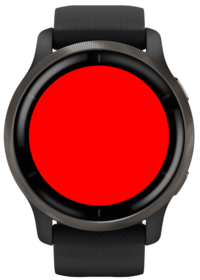

A garmin watch datafield that shows a breadcrumb trail. For watches that do not support breadcrumb navigation out of the box.

Donations are always welcome, but not required: https://www.paypal.com/paypalme/pauljohnston2025

Information on all the settings can be found in [Settings](settings.md)  
note: Map support is disabled by default, but can be turned on in app settings, this is because map tile loading is memory intensive and may cause crashes on some devices. You must set `Tile Cache Size` if using maps to avoid crashes.    
Companion app can be found at [Companion App](https://github.com/pauljohnston2025/breadcrumb-mobile.git)  
[Companion App Releases](https://github.com/pauljohnston2025/breadcrumb-mobile/releases/latest)

---

# Bug Reports

To aid in the fastest resolution, please include.

- Some screenshots of the issue, and possibly a recording
- A reproduction case of exactly how to reproduce the issue
- What you expected to happen
- The settings that you had enabled/disabled (a full screenshot of all the settings is best)

Please ensure any images/recordings do not contain any identifying information, such as your current location.

If the watch app encounters a crash (connect iq symbol displayed), you should also include the crash report. This can be obtained by:

* Connect the watch to a computer
* Open the contents of the watch and navigate to  `<watch>\Internal Storage\GARMIN\APPS\LOGS`
* Copy any log files, usually it is called CIQ_LOG.LOG, but may be called CIQ_LOG.BAK

You can also manually add a text file `BreadcrumbDataField.TXT` to the log directory (before the crash), and any app logs will be printed there. Please also include this log file.

---

# Development

Must port forward both adb and the tile server for the simulator to be able to fetch tiles from the comapnion app

* adb forward tcp:8080 tcp:8080
* adb forward tcp:7381 tcp:7381

---

# Garmin Iq Store Content

Can be used without the companion app, but will only show current track.
Use the companion app to add a route that you can follow.

Intended for use with round watches, but will work on others (might not look the best though).  
Some watches/devices with touch support will be able switch between elevation and track view during activity.

Target User: Hikers, backpackers, cyclists, trail runners, and outdoor enthusiasts seeking a flexible navigation tool for their Garmin watches. Especially valuable for users with Garmin devices that do not have built-in map support. Suitable for both on- and off-grid exploration, with customizable maps and route following capabilities.

Key Features:

Breadcrumb Trail Navigation: Displays a route as a breadcrumb trail overlaid on a map, allowing users to easily follow the intended path. Brings map-based navigation to Garmin devices that do not have native map support.  
Map Tile Loading (Online): Supports any tile server that uses EPSG:3857 image tiles.  
Map Tile Loading (Offline): Loads pre-cached tile data from the companion app.  
Off-Track Alerts (needs to be enbaled in garmins setting menu, see below): Notifies the user when they deviate from the planned route.  
Elevation Overview: Shows an elevation profile of the route, allowing users to anticipate upcoming climbs and descents.  
Routing (companion app required): Users can import routes from Google Maps or GPX files using the companion app.  
Customizable Settings: Fully customizable via the watch or Connect IQ settings. No companion app required for basic functionality.  
Breadcrumb-Only Mode: (Optional) A simplified display mode showing only the breadcrumb trail, without the underlying map tiles, for increased battery life on devices with limited screen resolution or memory.

Companion app:
The companion app is available on my github: https://github.com/pauljohnston2025/breadcrumb-mobile.git  
While all settings can be configured directly on the watch or through Connect IQ settings, the companion app unlocks powerful features such as offline map support via Bluetooth transfer and route loading. Currently, the companion app is only available on Android, but contributions from iOS developers are highly welcomed to expand platform support and bring these functionalities to a wider audience.

This is a datafield, not a full fledged app, it runs in the context of native activity.

The datafield is expected to be used to cover the full available area of a round watchface.  
It will still work with non-round devices or partial layouts, but the full feature set of the ui will not be possible due to the limited space.

To add datafield to a native app:

- Open the app (eg. running), you do not have to start the activity, just open it.
- Long press to open settings (or use the touchscreen to press settings)
- Navigate to Data Screens
- Select screen
- Choose layout - recommended full screen layout
- Edit data fields - choose the 'BreadCrumbDataField' from the 'ConnectIQ Fields' menu

For the venu range: https://support.garmin.com/en-AU/?faq=gyywAozBuAAGlvfzvR9VZ8&identifier=707572&searchQuery=data%20field&tab=topics  
A more thorough explaination for a different app can be found at: https://support.garmin.com/en-AU/?faq=3HkHX1wT6U7TeNB7YHfiT7&identifier=707572&searchQuery=data%20field&tab=topics

---

# Known Issues

Some screens appear to have an offset applied to the [dc](https://developer.garmin.com/connect-iq/api-docs/Toybox/Graphics/Dc.html), that I cannot find a way to correct. Sometimes this offset occurs on my own physical device, and other times there is no offset. If anyone knows how to solve this, please let me know. I believe this is an issue with garmins datafield obscurity, since you can have the datafield take up only part of the screen. The problem still occurs when the datafield takes up the whole screen though (I think garmin reservese certain areas of the screen for thier own ui components). Note this clipping may also be noticed on different parts of the screen if bufferred map rotations are enabled, since everything drawn to the dc is offset.

Simplest reproduction example, it appears the device context for drawing is already offset (but only sometimes).

```
function onUpdate(dc as Dc) as Void {
    dc.setColor(Graphics.COLOR_RED, Graphics.COLOR_RED);
    dc.clear();
}
```

The white areas in the bellow images show the issue.




---

# Map Tiles

Powered by Esri: https://www.esri.com  
OpenStreetMap: https://openstreetmap.org/copyright  
OpenTopoMap: https://opentopomap.org/about  
Google: https://cloud.google.com/maps-platform/terms https://policies.google.com/privacy  
Carto: https://carto.com/attribution  
Stadia: &copy; <a href="https://stadiamaps.com/" target="_blank">Stadia Maps</a> &copy; <a href="https://openmaptiles.org/" target="_blank">OpenMapTiles</a> &copy; <a href="https://www.openstreetmap.org/copyright" target="_blank">OpenStreetMap</a>

---

# Licencing

Attribution-NonCommercial-ShareAlike 4.0 International: https://creativecommons.org/licenses/by-nc-sa/4.0/  

---
