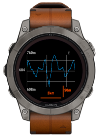
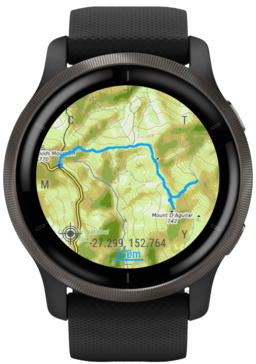
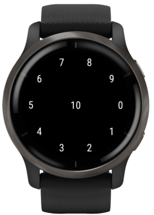

All settings are editable from 4 places.

- The [connect iq store](#garmin-settings-connect-iq-store) where you installed the app
- [On Device](#on-device)
- [Companion App](https://github.com/pauljohnston2025/breadcrumb-mobile/blob/master/manual.md#device-settings-page)
- [On Screen UI](#ui-mode)

The connectiq store does not work for all settings (namely route configuration), use the on device or companion app settings instead.

# Garmin Settings (Connect Iq Store)

---

### Display Mode

Configure which screen is displayed for the datafield.

Track/Route - Current track, and any loaded routes, will be shown  
  
Elevation - An elevation chart showing current distance and the route/track profile.  
  
Map Move - Should only be used if maps are enabled, allows panning around the map at a set zoom.  
  
Debug - A debug screen that may be removed in future releases. Shows the current state of the app.  

---

### UI Mode

There is an on screen ui that can be used to control different parts of the watch app, this ui can be hidden or entirely disabled.

Show On Top - Show the ui and the current state of everything its controlling  
Hidden - Still responds to touch but does not display the current state  
Disabled - No touch handling, no display of state

The ui appears on most screens, but is limited to what that screen can do.

The Track/Route page allows you to do the most with the onscreen ui.  

Clear Route - Will prompt you if you are sure, and let you clear all routes on the device  
Zoom at Pace Mode - See [Zoom At Pace Mode](#zoom-at-pace-mode)

- M - zoom when moving
- S - zoom when stopped
- N - Never zoom
- A - Always zoom

Return To User - Allows you to return to the users location, and resume using Zoom at Pace Mode to determine the scale and zoom level. It is only shown when the map has been panned or zoomed away from the users location.  
Display Mode - See [Display Mode](#display-mode)

- T - Track/Route
- E - Elevation
- M - Map Move
- D - Debug

Map Enabled - See [Map Enabled](#map-enabled)

`+` Button (top of screen) allows zooming into the current location  
`-` Button (bottom of screen) allows zooming out of the current location

Other Screens:  
Map move allows you to pan around the map, clear routes and toggle the display mode.  
Elevation allows you to clear routes and toggle display mode.  
The debug screen only allows you to toggle the display mode.

---

### Compute Interval

The number of seconds that need to elapse before we try and add or next track point. Higher values should result in better battery performance (less calculations), but will also mean you need to wait longer for the map and track to update. This setting is also used to control how often to refresh the buffer if using a buffered render mode.

---

### Render Mode

Buffered Rotations - Keeps a buffer of the map, track and routes in memory (only refreshes every Compute Interval). Should result in better performance and less battery consumption, a the cost of higher memory usage for the buffer.  
Unbuffered Rotations - No buffer, all rotations are done manually every compute, will take more cpu to calculate each time a render occurs. Allows low memory devices to still have rotating maps.  
Buffered Without Rotations - Same as Buffered Rotations mode but does not rotate the map.  
No Buffer No Rotations - Same as Unbuffered Rotations mode but does not rotate the map.

---

### Zoom At Pace Mode

Controls the zoom level at different speeds

Zoom When Moving - Typically used for a running/hiking so you can see the next upcoming turn whilst you are moving. When stopped the map will return to fully zoomed out so you can investigate your position on the overall route.  
Zoom When Stopped - Inverse of Zoom When Moving  
Never Zoom - Always shows the full route/track overview  
Always Zoom - Always shows `Zoom At Pace Meters` regardless of the speed

### Zoom At Pace Meters Around User

How far, in meters, to render around the user when zoomed in.

### Zoom At Pace Speed

How fast, in m/s, the user needs to be moving in order to trigger zoom changes.

---

### Map Enabled

Enables the map tile rendering.
Choose these values wisely. Too big = crash, too small = crash or slow performance.

Best Guess for map settings:  
Tile Cache Size if using zoom at pace: `2*<Tile Cache Size without zoom at pace>`  
Tile Cache Size if NOT using zoom at pace: `((2 * ceil(<screen size>/<tile size>)) + 2 * <tile cache padding>)^2`  
Max Pending Web Requests: `Tile Cache Size`  
eg. On my venu2s if scale is set to `0.075` it uses approximately 10\*10 tiles to fill the screen, this means the tile cache would need to be set to at least 100 (at 64 you can see the tiles loading and unloading)  
The math above is worst case, if you pick a better fixed scale or `Meters Around User` then the tile cache size can be significantly reduced (by at least half). Layer min/max could also be used to specify a fixed layer and further reduce the need for tiles in memory (since we can zoom in and make a single tile cover the screen). All these settings are here so users can configure their own memory requirements for the best battery life and stability. I suggest settings the scale to one that you like, and then reducing the tile cache size until black squares appear to find the tile cache lower limit.

### Map Choice

Pick from a list on tile servers, select custom if you wish to manually specify a tileUrl.
Currently this dropdown is an override for

* tileUrl
* tileLayerMax
* tileLayerMin
* tileSize

All other options in map settings can still be changed. Settings such as tile cahe size should be set to something much smaller to avoid crashes.
If you need to tweak the tileUrl or other controlled settings (such as tileSize for companion app)
* first select the tile server that matches most closely eg. `companion app`
* save settings
* go back into settings and select `custom`
* edit the settings that need to be changed
* save settings

### Tile Url

Should be 'http://127.0.0.1:8080' for companion app (which supports offline maps) or template eg. 'https://a.tile.opentopomap.org/{z}/{x}/{y}.png'.

For online maps (requested directly from the watch), the tile server url can be set to something like:

Open Topo Map:  
Terain: https://a.tile.opentopomap.org/{z}/{x}/{y}.png

OpenStreetMap will not work as a templated tile server on the watch because makeImageRequest does not allow headers to be sent. OpenStreetMap requires that the User-Agent header be sent or it will respond with 403. Use the tile server hosted on the companion app if you wish to use OpenStreetMap.  
~~OpenStreetMap:~~  
~~Standard: https://tile.openstreetmap.org/{z}/{x}/{y}.png~~

Google:  
Hybrid: https://mt1.google.com/vt/lyrs=y&x={x}&y={y}&z={z}  
Satellite: https://mt1.google.com/vt/lyrs=s&x={x}&y={y}&z={z}  
Road: https://mt1.google.com/vt/lyrs=m&x={x}&y={y}&z={z}

Esri:  
View available tiles at https://server.arcgisonline.com/arcgis/rest/services/

World Imagery (Satellite): https://server.arcgisonline.com/ArcGIS/rest/services/World_Imagery/MapServer/tile/{z}/{y}/{x}  
World Street Map: https://server.arcgisonline.com/ArcGIS/rest/services/World_Street_Map/MapServer/tile/{z}/{y}/{x}  
World Topo Map: https://server.arcgisonline.com/ArcGIS/rest/services/World_Topo_Map/MapServer/tile/{z}/{y}/{x}  
World Hillshade Base: https://server.arcgisonline.com/arcgis/rest/services/Elevation/World_Hillshade/MapServer/tile/{z}/{y}/{x}

Carto:  
Voyager: https://a.basemaps.cartocdn.com/rastertiles/voyager/{z}/{x}/{y}.png  
Dark Matter: https://a.basemaps.cartocdn.com/rastertiles/dark_all/{z}/{x}/{y}.png  
Light All: https://a.basemaps.cartocdn.com/rastertiles/light_all/{z}/{x}/{y}.png

### Tile Size

Tile size should be a multiple of 256 for best results. The tile size in pixels loaded from the companion app or other source. Should be 256 if using a template. There are known issues with setting it smaller (performance being a big one), but it does work on some devices.

### Tile Layer Max

The maximum tile layer that can be fetched.

### Tile Layer Min

The minimum tile layer that can be fetched.

### Tile Cache Padding

The maximum tiles to grab around the user 0 means no more than the screen size. 1 will give you one extra layer of tiles as a buffer (so they are pre loaded when we move into that area)

### Tile Cache Size

The number of tiles to store locally in memory.

### Max Pending Web Requests

The max number of tile fetch requests we can have queued ready to be sent.

### Disable Maps After X Failures

Maps will be automatically disabled if this many tile fetch requests fail. 0 - unlimited

### Fixed Latitude

The latitude to render (must also set longitude)

### Fixed Longitude

The longitude to render (must also set latitude)

Set both latitude and longitude to 0 to disable fixed position and use the current location.

---

### Off Track Distance

The number of meters you need to be off track for an alert to be triggered or a line to be drawn back to the track.

### Draw Line To Last Point

Draw a line back to the spot where you left the route (only works if a single route is enabled).

### Off Track Alerts

Trigger an alert when you leave the track by `Off Track Distance`.

### Off Track Alerts Max Report Interval

How often, in seconds, an alert should fire. Alerts will continue firing until you return to the planned route.

### Off Track Alerts Alert Type

Toast (notification): Some devices have issues with alerts rendering, so you can use a toast. This is the default as it does not require enabling alerts on the device.  
Alerts: Send an alert instead of a toast, to use this you need to also enable alerts for the datafield in the activity settings. see [Through Alerts](#through-alerts)

---

### Colours

Should be set to a valid hex code RRGGBB not all are required eg. FF00 will render as green

Track Colour - The colour of the in progress track  
Elevation Colour - The colour of the scale/numbers on the elevation page  
User Colour - The colour of the user triangle (current user position)  
Normal Mode Colour - The colour of scale/numbers on the track/routes page  
UI Colour - The colour of the on screen ui  
Debug Colour - The colour of the debug page

---

### Routes

Garmin has an issue with array settings where they cannot be modified by the connect iq app. It appears to be a known issue, but unlikely to be solved. Per route settings should be edited from the watch only, attempts to edit them from the connect iq settings page will likely break until garmin fix the issue.

### Enable Routes

Global route enable/disable flag. If disabled turns off all routes, or if enabled allows routes that are enabled to render.

### Display Route Names

enabled:

disabled:

### Max Routes

The maximum number of routes to store on the device, set to 1 if you want each new route loaded on the device to be the only one shown. Multiple routes are handy to add different parts of a course, or for multisport activities such as triathlons, each part of the course can be a separate colour.

### Per Route settings

Id - The id of the route - read only  
Name - Defaults to the route name that was added, but can be modified to anything you desire.  
Enabled - If this route appears on any of the device screens, routes can be disabled so that multiple routes can be pre loaded and enabled when needed. eg. Day 1, Day 2.  
Route Colour - The colour of the route.

# On Device

It is much easier to configure the settings from the ConnectIQ store, or through the companion app, but it is possible to use the on device settings. All of the settings should have the same names, see above for explanation on each setting.

To use the number/colour pickers entering the value by touching characters/numbers on the screen then confirmed/removed by pressing the device buttons. Confirm to confirm on screen selection, back to delete a character or exit without making a change.

### Before Activity Start

To edit settings from on device (on venu series):

- Ensure the data field is added to your activity of choice
- Open the app (eg. running). DO NOT start the activity, you can only edit before activity start.
- Use touch screen to slide up settings. DO NOT long press, as that only gives you access to the run settings (layouts etc.), not our settings
- You should now see a menu 'ConnectIQ Fields'
- From here we can select 'BreadcrumbDataField' and modify our settings

### Through Alerts

Settings can now also be now be edited through the alerts menu (on venu series):

- Ensure the data field is added to your activity of choice
- Open the app (eg. running). Start the activity.
- Long press the bottom button to open run settings
- Click Alerts / Add new
- Scroll down to 'Connect IQ'
- From here we can select 'BreadcrumbDataField' and modify our settings
- Opening the settings again can be found in the alerts tab (click 'BreadcrumbDataField' then modify settings)
