# Prerequisites

If enabling map tiles or trying to send routes to the watch app you will require a bluetooth connection with a phone running the [Companion App](https://github.com/pauljohnston2025/breadcrumb-mobile.git), and the [garmin connect app](https://play.google.com/store/apps/details?id=com.garmin.android.apps.connectmobile&hl=en_AU).  
If you just wish to use the breadcrumb track feature (a trail of your current track), it can be used without any phone connection.  
Map support can be enabled without the companion app, but the [garmin connect app](https://play.google.com/store/apps/details?id=com.garmin.android.apps.connectmobile&hl=en_AU) must still be installed, and an active bluetooth connection maintained.

This is a datafield, not a full fledged app, it runs in the context of native activity.  
The datafield is expected to be used to cover the full available area of a round watchface.  
It will still work with non-round devices or partial layouts, but the full feature set of the ui will not be possible due to the limited space.

To add datafield to a native app:

1. Open the app (eg. running), you do not have to start the activity, just open it.
1. Long press to open settings (or use the touchscreen to press settings)
1. Navigate to Data Screens
1. Select screen
1. Choose layout - recommended full screen layout
1. Edit data fields - choose the 'BreadCrumbDataField' from the 'ConnectIQ Fields' menu

Some helpful guides on adding data fields:

- [For the venu range](https://support.garmin.com/en-AU/?faq=gyywAozBuAAGlvfzvR9VZ8&identifier=707572&searchQuery=data%20field&tab=topics)
- [A more thorough explanation for a different app](https://support.garmin.com/en-AU/?faq=3HkHX1wT6U7TeNB7YHfiT7&identifier=707572&searchQuery=data%20field&tab=topics)

---

All settings are editable from 4 places.

- The [connect iq store](#garmin-settings-connect-iq-store) where you installed the app
- [On Device](#on-device)
- [Companion App](https://github.com/pauljohnston2025/breadcrumb-mobile/blob/master/manual.md#device-settings-page)
- [On Screen UI](#ui-mode)

The connectiq store does not work for all settings (namely route configuration), use the on device or companion app settings instead.

# Garmin Settings (Connect Iq Store)

---

### Display Mode

Configure which screen is displayed for the datafield.

Track/Route - Current track, and any loaded routes, will be shown  
  
Elevation - An elevation chart showing current distance traveled, current elevation and the route/track profile.  
  
Map Move - Should only be used if maps are enabled, allows panning around the map at a set zoom.  
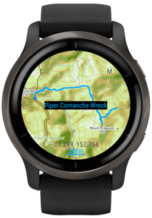  
Debug - A debug screen that may be removed in future releases. Shows the current state of the app.  
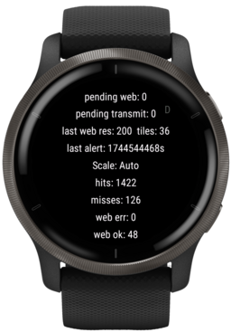

### Display Lat/Long

Determines if the curent latitude and longitide are displayed on the watch screen.

---

### UI Mode

There is an on screen ui that can be used to control different parts of the watch app, this ui can be hidden or entirely disabled.  
Note: There is a limitation on garmin that datafields can only receive tap events see [input-handling](https://developer.garmin.com/connect-iq/core-topics/input-handling/), this also means I cannot handle any physical button presses. All of the settings should be configurable from the companion app without using the onscreen ui.  

Show On Top - Show the ui and the current state of everything its controlling  
Hidden - Still responds to touch but does not display the current state  
Disabled - No touch handling, no display of state

The ui appears on most screens, but is limited to what that screen can do.

The Track/Route page allows you to do the most with the onscreen ui.  

Clear Route - Will prompt you if you are sure, and let you clear all routes on the device  
Zoom at Pace Mode - See [Zoom At Pace Mode](#zoom-at-pace-mode)

- M - zoom when moving
- S - zoom when stopped
- N - Never zoom
- A - Always zoom
- R - Routes Without Track

Return To User - Allows you to return to the users location, and resume using Zoom at Pace Mode to determine the scale and zoom level. It is only shown when the map has been panned or zoomed away from the users location.  
Display Mode - See [Display Mode](#display-mode)

- T - Track/Route
- E - Elevation
- M - Map Move
- D - Debug

Map Enabled - See [Map Enabled](#map-enabled)

`+` Button (top of screen) allows zooming into the current location  
`-` Button (bottom of screen) allows zooming out of the current location  
`G` Button (right of screen) Get the current tiles for the currently viewed area and put them into app storage (all tile layers), this allows offline navigation without a phone connection. This is an incredibly slow process, but should improve battery as all bluetooth can be done in advance before heading out the door, then the device can be fully charged. note: this will cache tiles regardless of the [Store Tiles For Offline Use](#store-tiles-for-offline-use) setting. For more details see [Offline Tile Storage](#offline-tile-storage). The process of downloading all the tiles takes a very long time, it is best to set the tile server max/min layers so that the tiels downloaded are limited.

Other Screens:  
Map move allows you to pan around the map, clear routes and toggle the display mode. see [Map Move Screen Size](#map-move-screen-size) for configuring how far to move.
Elevation allows you to clear routes and toggle display mode.  
The debug screen only allows you to toggle the display mode.

---

### Elevation Mode

Stacked - Draw all routes and the current track ontop of each other, the first point of each route will be on the left of the screen  
Route 1 - Blue, Route 2 - Red, Current Track - Green  
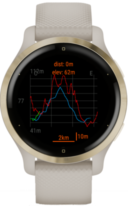  
OrderedRoutes - Draw all routes one after the other, and overlay the track ontop. Generally best when each route is a different part of an overall route, eg. triathlons. Ensure you load the routes in the correct order on the device, an incorrect order will lead to elevation data being in the wrong spot.  
Route 1 - Blue, Route 2 - Red, Current Track - Green  
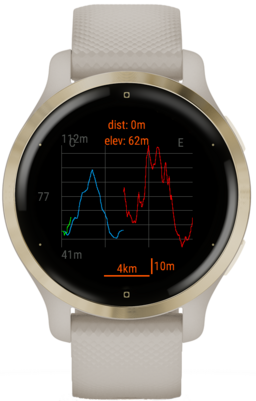

---

### Compute Interval

The number of seconds that need to elapse before we try and add or next track point. Higher values should result in better battery performance (less calculations), but will also mean you need to wait longer for the map and track to update. This setting is also used to control how often to refresh the buffer if using a buffered render mode. A lower number should be used for high speed activities such as cycling.

---

### Render Mode

Buffered Rotations - Keeps a buffer of the map, track and routes in memory (only refreshes every Compute Interval). Should result in better performance and less battery consumption, a the cost of higher memory usage for the buffer.  
Unbuffered Rotations - No buffer, all rotations are done manually every compute, will take more cpu to calculate each time a render occurs. Allows low memory devices to still have rotating maps. Note: this mode does make the map tiles visible as small artifacts between the map tiles, so maps do not look the best in this mode.  
Buffered Without Rotations - Same as Buffered Rotations mode but does not rotate the map.  
No Buffer No Rotations - Same as Unbuffered Rotations mode but does not rotate the map.

### Center User Offset Y

Offsets the users vertical position by a fraction of the screen size. Larger values will move the position further down the screen. eg. 0.5 - user in the middle, 0.75 user 3/4 of the way down the screen (near the bottom), 0.25 user near the top of the screen. Larger values are generally preferred, as it allow you to see more of the route in front of the users position. The osers offset only apploes when 'zooming' around the user, see [Zoom At Pace Mode](#zoom-at-pace-mode). Note: The offset can also be applied if you have manually zoomed into the map and have overridden the Zoom At Pace Mode.  

Beware, moving the user from the center position can have implications on the number of tiles that need to be cached if using rotating [render modes](#render-mode) and [maps](#map-enabled). Furthermore since the virtual screen size is increased when using buffered rendering modes the app also needs to store a larger frame buffer in order to be able to rotate. The larger buffer, along with the larger number of tiles required, puts alot of strain on the graphics memory pool and it is quite easy to either crash the app or cause it to throw exceptions every time if the users offset is moved away from the center position. It is highly encouraged to thouroughly test the limits of the cache by panning around the map and looking at debug page to ensure the app is at full cache capacity to ensure no crashes occur with the values selected. On my venu2s I have found 56 companion app tiles (size: 64X64) to be the limit when using buffered rotation render mode and a user center offset of 0.7. When using image tiles (served straight to the watch) the limit will be much lower. It is receomended to use unbuffered rotation mode for any large offset from the center position (ie <0.25 or >0.75), but this has the downside of seeing the tile seams.  

some math:  

screen size: 360
offset: 0.75
virtual screen size (buffered bitmap size): 0.75*360*2 = 540
tile size: 64*64
require tile cache size just to fill one buffered bitmap: ceil(540/64)^2 = 81

Redoing the math for offset 0.6 the required cache size is just 49 tiles.

Of course different zoom levels and scaled tile size will result in each tile taking up more/less of the space than 64, but its a generally good guage of how large the cache needs to be.

---

# Zoom At Pace

Controls how the app zooms around the user, ie. it changes the viewport (based on speed or not).

### Zoom At Pace Mode

Controls the zoom level at different speeds

Zoom When Moving - Typically used for a running/hiking so you can see the next upcoming turn whilst you are moving. When stopped the map will return to fully zoomed out so you can investigate your position on the overall route.  
Zoom When Stopped - Inverse of Zoom When Moving.  
Never Zoom - Always shows the full route/track overview.  
Always Zoom - Always shows `Zoom At Pace Meters` regardless of the speed.  
Routes Without Tack - Same as `Never Zoom` but does not include the track in the bounding box. Useful for caching a route, Can view the route without the curent location changin the map zoom. Also handly for users that do not care about venturing outside the route area.

### Zoom At Pace Meters Around User

How far, in meters, to render around the user when zoomed in.

### Zoom At Pace Speed

How fast, in m/s, the user needs to be moving in order to trigger zoom changes.

---

# Map Settings

### Map Enabled

Enables the map tile rendering.
Choose these values wisely. Too big = crash, too small = crash or slow performance.  
note: Map support is disabled by default, this is because map tile loading is memory intensive and may cause crashes on some devices. You must set `Tile Cache Size` if using maps to avoid crashes.

Best Guess for map settings:  
Note the screen size is effected by [Center User Offset Y](#center-user-offset-y) if the user is moved away from teh center, we need to emulate a larger virtual screen so that the tiles can be cached for any upcomming rotations. This is only an issue if using a rotating [render mode](#render-mode).   
`screen size = (abs((
 * <pyhsical screen size>) - <half pyhsical screen size>) + <half pyhsical screen size>) * 2`  
ie. Twice the largest dimension from the screen edge to the users center position.   

Tile Cache Size if using zoom at pace: `2*<Tile Cache Size without zoom at pace>`  
Tile Cache Size if NOT using zoom at pace: `((2 * ceil(<screen size>/<tile size>)) + 2 * <tile cache padding>)^2`  
Tile Cache Size if using Restrict Scale To Tile Layers: `((ceil(<screen size>/<tile size>)) + 2 * <tile cache padding>)^2`  
Max Pending Web Requests: Can be fairly low, map tile requests are queued up pretty fast.  
eg. On my venu2s if scale is set to `0.075` it uses approximately 10\*10 tiles to fill the screen, this means the tile cache would need to be set to at least 100 (at 64 you can see the tiles loading and unloading)  
The math above is worst case, if you pick a better fixed scale or `Meters Around User` then the tile cache size can be significantly reduced (by at least half). Layer min/max could also be used to specify a fixed layer and further reduce the need for tiles in memory (since we can zoom in and make a single tile cover the screen). All these settings are here so users can configure their own memory requirements for the best battery life and stability. I suggest settings the scale to one that you like, and then reducing the tile cache size until black squares appear to find the tile cache lower limit.

You can also set `<Scaled Tile Size>` to reduce the cache requirements further, if `<Scaled Tile Size>` is set to 128, `<Scaled Tile Size>` and `<Full Tile Size>` is 256, then the tile cache size can be reduced by a factor of 4. ie. `(<Full Tile Size>/<Scaled Tile Size>)^2`.

### Tile Cache Padding

The maximum tiles to grab around the user 0 means no more than the screen size. 1 will give you one extra layer of tiles as a buffer (so they are pre loaded when we move into that area)

### Tile Cache Size

The number of tiles to store locally in memory. The maximum value for this can be figuresd out by the user (each device and scenerio is different)

- choose your tile url or map choice
- set Disable Maps After X Failures (0 for unlimited failures) = 0 - temporary setting so we can test our limits
- set Tile cache padding (tiles) to 5 - temporary setting this just makes us fill the tile cache quicker
- zoom in and out of the map
- check the debug page regulary to see how many map tiles are in the cache
- last web result will likely go to -403 (NETWORK_RESPONSE_OUT_OF_MEMORY), or the app will crash with out of memory exception
- check the tiles number on the debug page, and set that to your cache value (a little less is better as this is our absolute max)

On the venu2s with full size tiles (256pixels) the max tile cache is ~23, so we probbaly do not want to exceed 15 tiles in our cache to be safe. The more tiles in the cache, the more memory that will be used and the sytem will slow to a crawl. For smaller tiles the cache size will be larger, as each tile takes up less space in memory.

See [Storage Tile Cache Size (tiles)](#storage-tile-cache-size-tiles) for a way to increase the available tiles without setting the in memory tile limit to a huge value.

### Max Pending Web Requests

The max number of tile fetch requests we can have queued ready to be sent. (this can be 0, and we will only allow outstanding requests)

### Disable Maps After X Failures
N
Maps will be automatically disabled if this many tile fetch requests fail. 0 - unlimited

### Fixed Latitude

The latitude to render (must also set longitude)

### Fixed Longitude

The longitude to render (must also set latitude)

Set both latitude and longitude to 0 to disable fixed position and use the current location.

### Restrict Scale To Tile Layers

Only allow zooming in/out to the tile layer limits. Also all steps between scales will be the next tile layer (no tile scaling).

### Http Error Tile TTL (s)

How long to wait before querying errored tiles again, this is for valid htp errors such as 404 - Not Found or 403 - Forbidden.

### Error Tile TTL (s)

How long to wait before querying errored tiles again, this is for garmin errors (ble unavailable, etc.)  
garmin error codes are documented [here](https://developer.garmin.com/connect-iq/api-docs/Toybox/Communications.html#Error-module)

### Map Move Screen Size

How far to move across the screen when panning the map using the on screen ui. Relative to screen size, eg. 0.3 moves a third of the screen, 0.5 moves half the screen.   

---

# Tile Server Settings

### Map Choice

Pick from a list on tile servers, select custom if you wish to manually specify a tileUrl. The companion app tile server is not supported on some low memory devices.  
Note: tiles that are more monochrome will download faster, as they have less colour variance and can be compressed further. Stadia's `Stamen Toner`, Stadia's `Alidade Smooth Dark`, Esri's `World Dark Gray Base` or Carto's `Dark Matter` are good examples of this. I noticed a 2X speed improvement on map tile downloads compared to full satellite tiles. Note: The tile load speed when using the companion app is a constant speed, as it can use a reduced palette. The companion app is often faster than full tile downloads when using the 64 colour mode, though the reduced colour palette may not appeal to some users. The faster tile loads also have the benefit if draining the battery less, as less bytes are sent over bluetooth.

When using the companion app map choice the tile layer max and min (and any other settngs that need pulling from the app) will be loaded from the companion app tile server. If this is not running at he time the map choice is made, the update will fail, and you will be reduced to a low amount of xzoom levels (or blury map tiles). If this occurs the easiest way to fix it is open the companion app and change the companion apps tile server tosoething different, and then back to the desiredvalue (ensuring the tile server is running). Togleing the tile server on the companion app will also send an update of the tile layer max and min to the watch.

Currently this dropdown is an override for:

- tileUrl
- tileLayerMax
- tileLayerMin
- tileSize
- tileCacheSize - note this is only capped at an upper limit (guess per device), lower numbers will not be changed

Due to how garmins settings work, to see changes in the above fields you need to.

- Open settings
- Pick map choice
- Save settings
- Open settings

This is the same for the companion app, and means you should probably only change map choice (and not any other settings) in the one settings save. Modifying the settings directly from the watch does no suffer this issue, and the properties should update immediately.

All other options in map settings can still be changed. Settings such as tile cache size should be set to something much smaller to avoid crashes.

If you need to tweak the tileUrl or other controlled settings (such as tileSize for companion app)

- First select the tile server that matches most closely eg. `companion app`
- Save settings
- Go back into settings and select `custom`
- Edit the settings that need to be changed
- Save settings

Please note, some map choices require an auth token, see [Auth Token](#auth-token)

### Tile Url

Should be 'http://127.0.0.1:8080' for companion app (which supports offline maps) or template eg. 'https://a.tile.opentopomap.org/{z}/{x}/{y}.png'.
The companion app tile server is not supported on some low memory devices.  

For online maps (requested directly from the watch), the tile server url can be set to something like:

Open Topo Map:  
Terain: https://a.tile.opentopomap.org/{z}/{x}/{y}.png

OpenStreetMap  
Will not work as a templated tile server on the watch because makeImageRequest does not allow headers to be sent. OpenStreetMap requires that the User-Agent header be sent or it will respond with 403. Use the tile server hosted on the companion app if you wish to use OpenStreetMap.  
~~OpenStreetMap:~~  
~~Standard: https://tile.openstreetmap.org/{z}/{x}/{y}.png~~

Google:  
Will not work as a templated tile server on the watch because makeImageRequest does not allow headers to be sent. Google also requires that the User-Agent header be sent.
~~Hybrid: https://mt1.google.com/vt/lyrs=y&x={x}&y={y}&z={z}~~  
~~Satellite: https://mt1.google.com/vt/lyrs=s&x={x}&y={y}&z={z}~~    
~~Road: https://mt1.google.com/vt/lyrs=m&x={x}&y={y}&z={z}~~  

Esri:  
View available tiles at https://server.arcgisonline.com/arcgis/rest/services/

World Imagery (Satellite): https://server.arcgisonline.com/ArcGIS/rest/services/World_Imagery/MapServer/tile/{z}/{y}/{x}  
World Street Map: https://server.arcgisonline.com/ArcGIS/rest/services/World_Street_Map/MapServer/tile/{z}/{y}/{x}  
World Topo Map: https://server.arcgisonline.com/ArcGIS/rest/services/World_Topo_Map/MapServer/tile/{z}/{y}/{x}  
World Hillshade Base: https://server.arcgisonline.com/arcgis/rest/services/Elevation/World_Hillshade/MapServer/tile/{z}/{y}/{x}

Carto:  
Voyager: https://a.basemaps.cartocdn.com/rastertiles/voyager/{z}/{x}/{y}.png  
Dark Matter: https://a.basemaps.cartocdn.com/rastertiles/dark_all/{z}/{x}/{y}.png  
Light All: https://a.basemaps.cartocdn.com/rastertiles/light_all/{z}/{x}/{y}.png

### Auth Token

The tile url can also include an auth token, that will be filled out from the Auth Token property eg. `?api_key={authToken}`. This is required for some map choices.  
For details on creating an account and auth token for stadia map choices please see https://docs.stadiamaps.com/  
For details on creating an account and auth token for mapy map choices please see https://developer.mapy.com/rest-api-mapy-cz/api-key/

### Tile Size

Tile size should be a multiple of Scaled Tile Size for best results. The tile size in pixels loaded from the companion app or other source. Should be equal to Scaled Tile Size if using a template url. Will be ignored if using a templated url.  

### Full Tile Size

The full tile size of the server, if using the companion app as the tile server, this is still the full size of the server the companion app is using. eg. opentopomaps. Normally this will be 256.

### Scaled Tile Size

The tile size to fetch images from the web (or companion app). Setting this to something like 128 will result in 4 times the performance (compared to 256), since the images we need to download are much smaller. Smaller sizes such as 128 come at the cost of resolution as each pixel of the downloaded tile will be 4 pixels on the screen (at full resolution). Smaller values are much faster, but may not look as nice (slightly blurry). Setting the scaled tile size also reduces the size of the tile cache, see the calculations in the maps description above. For perfect resolution this should be set to Full Tile Size, along with setting Restrict Scale To Tile Layers to true. Note: This setting only works if you have disabled [Use Draw Bitmap](#use-draw-bitmap) (the default).  

### Tile Layer Max

The maximum tile layer that can be fetched.

### Tile Layer Min

The minimum tile layer that can be fetched.

### Use Draw Bitmap

For devices that do not support using `drawBitmap2`, resort to drawing the bitmap with the older function `drawBitmap` instead. I noticed this in the simulator on some devices that drawBitmap2 would error is the device only has support for renderring the native colour format.  

The devices that I saw this on are:
* descentg2
* fenix7
* fenix7pro
* fenix7pronowifi
* fenix7s
* fenix7spro
* fenix7x
* fenix7xpro
* fenix7xpronowifi
* fr165
* fr255
* fr255m
* fr255s
* fr255sm
* instinct3amoled45mm
* instinct3amoled50mm

I suspect it may work on some physical devices, and the simulator is just bugged, please let me know your findings if you have any of these devices.  

To use this settings you will need to:

* Set [Scaled Tile Size](#scaled-tile-size) to the [Full Tile Size](#full-tile-size), this is because drawBitmap does not support scaling.
* Set [Restrict Scale To Tile Layers](#restrict-scale-to-tile-layers) to true, we cannot scale the images.
* You may also need to set [Packing Format](#packing-format) 

Failure to do any of the above will result in incorrect map scaling.

### Packing Format

Some devices do not support all image formats, we default to PACKING_FORMAT_YUV for its loading speed, and compression (faster ble transfers).

See garmins docs on each of the image formats available: https://developer.garmin.com/connect-iq/api-docs/Toybox/Communications.html#PackingFormat-module

Some formats will result in faster downloads, others will result in better render speeds. Each has a trade off, eg. the default packing format is not compressed, so will take up more space on device, but can be rendered much faster.  

---

# Offline Tile Storage

**_WARNING_** Several issues were encountered when trying to develop and use this feature. I had issues with the graphics memory filling up the system and had to reboot the watch to clear it. It seems mostly stable now, but some users may encounter issues.

A small number of tiles can be saved for complete offline use (no phone connection required). This is limited by the storage capacity of each device (the app storage, not the full storage capacity for music etc.). This is normally on the order of Mb, **NOT** Gb, so only a small number of tiles can be stored. For small routes enough tiles can be stored so that we can leave the phone at home. Storing tiles in this cache can also save battery power by not having to download map tiles over the bluetooth connection.

Note: I had some issues when different tile servers crashing the app with a system failure 'failed inside handle_image_callback' when using the tile server directly from the watch. The companion app did not seem to suffer this issue (likely because the tiles are much smaller). I tried a few preventative measures, but the issue still persists. If you have issues with offline maps, its best to change the tile server, or turn them off entirely (they are disabled by default).

Tiles can be cleared from storage through the on device settings `Map Settings -> Offline Tile Storage -> Clear Cached Tiles`.  
Tile caching for the current map area can be started by `Map Settings -> Offline Tile Storage -> Cache Current Area`, or by clicking the right side of the screen in [track view](#ui-mode) . This also shows the current number of tiles in the cache.  
Tile caching can be stopped by `Map Settings -> Offline Tile Storage -> Cancel Cache Download`.

Once the cache is full, older tiles will be removed and newer ones added. This means some of the higher resolution tiles might be missing if caching a large area (since we cache from the most zoomed in tiles out to the lowest zoom levels). The tile cache should be cleared to remove errored tiles. The tile cache will automatically be cleared when some map settings change, take care to ensure the tile cache is populated if you are going to use it to navigate offline (do not change map settings before heading out the door).

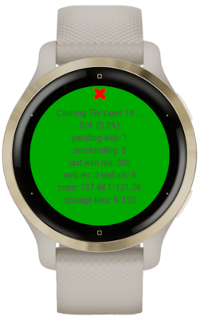

### Store Tiles For Offline Use

If enabled, allows map tiles to be stored on the device when they are queried from the web or companion app. Enabling this can extend the capacity of [Tile Cache Size](#tile-cache-size) and allows for extra tiles to be stored on device if the same part of the route is visited twice. It is generally a good idea to have this setting on, since it should save battery power and improve performance. You should set `Store Tiles For Offline Use` to false if you want to have an area of the map downloaded, and do not want any new tile downloads to overwrite the stored tiles.

### Only Use Stored Tiles (no ble data)

Only used the stored tiles from the watch, no ble data will be used to fetch tiles.

### Storage Tile Cache Size (tiles)

How many tiles to store on the watch. Take care with this settings, large values can cause crashes. Similar to [Tile Cache Size](#tile-cache-size), ensure you test the limits of your device and set this value with a reasonable buffer in mind. The storage cache (like the in memory cache) is a LRU (last recently used) cache, the least used tiles will be removed once the cache is full and a new tile needs to be added.

### Storage Seed Bounding Box

If enabled all tiles will be seeded for the on screen bounding box. This caches alot more tiles (and may hit limits of the offline storage cache), but is faster than processing all the routes. If it is disabled only the tiles that touch the path along the routes will be cached. The max distance of tiles from the route can be configured from [Storage Seed Route Distance M](#storage-seed-route-distance-m)

### Storage Seed Route Distance M

The number of meters to cache tiles around the routes path when using [Storage Seed Bounding Box](#storage-seed-bounding-box) = false.

---

# Off Track Alerts

Calculating off track alerts (either Draw Line To Closest Point, or Off Track Alerts) is a computationally heavy task. This means if there are multiple large routes the watch can error out with a watchdog error if our code executes too long. I have tested with up to 3 large routes on my venu2s, and it seems to handle it. Only enabled routes are taken into consideration. For multiple enabled routes, you are considered on-track if you are on at least one of the tracks. See the [Routes](#routes) section for use cases of multiple routes, eg. triathlons.

### Off Track Distance

The number of meters you need to be off track for an alert to be triggered or a line to be drawn back to the track.

### Off Track Check Interval

How often, in seconds, to run the calculation of off track alerts (since its expensive). Once you rejoin the track, a line will continue to be draw to the closest point on the closest enabled route until we recalculate. eg. an interval of 60 will mean the line will still be drawn for up to 1minute after we rejoin the track. This number should be set to multiple of [Off Track Alerts Max Report Interval](#off-track-alerts-max-report-interval) for best results, as an alert will only fire when we check if we are off track. eg. Set this to check once every 30 seconds, but set [Off Track Alerts Max Report Interval](#off-track-alerts-max-report-interval) to 60 so that we only get notified every minute when we are trying to rejoin the track. If this is set higher than [Off Track Alerts Max Report Interval](#off-track-alerts-max-report-interval) the alert interval effectively becomes the check interval. Note: alerts are only checked if the last track point changes, if you stand in the same spot after leaving the track, no further alerts will be triggered.

### Draw Line To Closest Point

Draw a line to the closests point on the closest enabled route.

### Draw Cheverons

Draw arrows in the direction of travel. Uses off track calculation to know where we are up to on the track, and draws arrows for the next few points on the trail.  

### Off Track Alerts

Trigger an alert when you leave a route by `Off Track Distance`.

### Wrong Direction Alerts

Trigger an alert when you navigate the track in the wrong direction. Note: this can take up to twice as long as [Off Track Check Interval](#off-track-check-interval) to detect travel in the wrong direction.  

### Off Track Alerts Max Report Interval

How often, in seconds, an alert should fire. Alerts will continue firing until you return to the planned route (or reach a section of another enabled route). Also controls the max alert speed for [Wrong Direction Alerts](#wrong-direction-alerts)

### Off Track Alerts Alert Type

Toast (notification): Some devices have issues with alerts rendering, so you can use a toast. This is the default as it does not require enabling alerts on the device.  
Alerts: Send an alert instead of a toast, to use this you need to also enable alerts for the datafield in the activity settings. see [Through Alerts](#through-alerts). Also controls the alert type for [Wrong Direction Alerts](#wrong-direction-alerts)

---

### Colours

Should be set to a valid hex code RRGGBB not all are required eg. FF00 will render as green

Track Colour - The colour of the in progress track  
Elevation Colour - The colour of the scale/numbers on the elevation page  
User Colour - The colour of the user triangle (current user position)  
Normal Mode Colour - The colour of scale/numbers on the track/routes page  
UI Colour - The colour of the on screen ui  
Debug Colour - The colour of the debug page

---

### Routes

Garmin has an issue with array settings where they cannot be modified by the connect iq app. It appears to be a known issue, but unlikely to be solved. Per route settings should be edited from the watch only, attempts to edit them from the connect iq settings page will likely break until garmin fix the issue.

### Enable Routes

Global route enable/disable flag. If disabled turns off all routes, or if enabled allows routes that are enabled to render.

### Display Route Names

enabled:
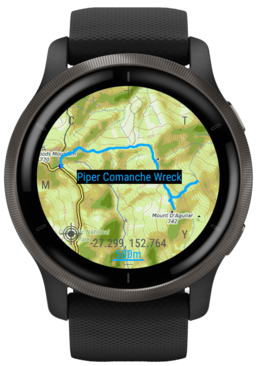
disabled:

### Max Routes

The maximum number of routes to store on the device, set to 1 if you want each new route loaded on the device to be the only one shown. Multiple routes are handy to add different parts of a course, or for multisport activities such as triathlons, each part of the course can be a separate colour. On some low memory devices this is hard coded to 1 and the setting cannot be changed.  

### Per Route settings

Id - The id of the route - read only  
Name - Defaults to the route name that was added, but can be modified to anything you desire.  
Enabled - If this route appears on any of the device screens, routes can be disabled so that multiple routes can be pre loaded and enabled when needed. eg. Day 1, Day 2.  
Route Colour - The colour of the route.  
Reversed - To reverse the direction of the route.

---

# Debug Settings

The watch app has a bunch of debug data to aid in development and help with bug reporting. Most users will not need to touch these settings, but some users may find it useful or like the look of the additional detail it provides. The debug settings and exactly what they control (and how they are displayed) can change at any time, some of them may be moved into other settings sections once they are stable.

### Show Points

Shows points at each latitude/longitude on the routes and track.

### Draw Line To Closest Point On Track

Similar to the off track alerts line, but draws the line to the closest point on the track. This is not always the current location, as

### Show Tile Borders

Shows borders for the map tiles

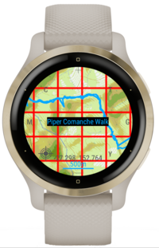

### Show Error Tile Messages

Shows error codes on the errored map tiles

Some custom error message are

- WD - Wrong data for tile (this may be null, or we got a string instead of a dictionary).
- UT - Unknown tile type (should be very rare, only occurs on outdated watches when we update supported tile format types in the companion app).
- FP - Failed to parse bitmap from the companion app tile response.
- S404 - Special error code to indicate that we are in storage only mode, and the tile was not in the storage.

Negative error codes are documented by garmin: https://developer.garmin.com/connect-iq/api-docs/Toybox/Communications.html#Error-module  
All other error codes should follow the http spec, eg. 404 - Not Found, 403 - Forbidden

The black tiles in the following images are errored, and will be queried again based on the [Http Error Tile TTTL (s)](#http-error-tile-ttl-s) or [Error Tile TTTL (s)](#error-tile-ttl-s) settings.

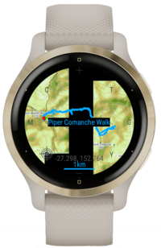
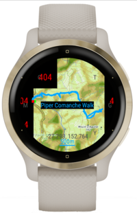

### Tile Error Colour

The colour to show in the background of errored tiles.

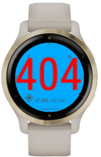
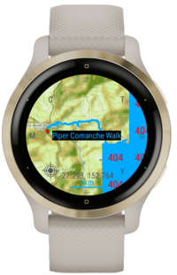

### Include Debug Page In On Screen Ui

Include the debug page when navigating between pages in the on screen ui.

---

### Return To User

Return to the users location, and automatic scaling. Use this after you have manually zoomed, or set the displayed latitude/longitude. Users with the on screen ui can also touch the crosshairs to return to the users location.  

### Restore Defaults

Clear all storage and reset settings to their default values.

---

# On Device

Only some high memory devices allow configuring the settings directly from the watch, all other devices will need to use an alternate method for configuring the settings.  
It is much easier to configure the settings from the ConnectIQ store, or through the companion app, but it is possible to use the on device settings. All of the settings should have the same names, see above for explanation on each setting.

To use the number/colour pickers entering the value by touching characters/numbers on the screen then confirmed/removed by pressing the device buttons. Confirm to confirm on screen selection, back to delete a character or exit without making a change.

### Before Activity Start

To edit settings from on device (on venu series):

- Ensure the data field is added to your activity of choice
- Open the app (eg. running). DO NOT start the activity, you can only edit before activity start.
- Use touch screen to slide up settings. DO NOT long press, as that only gives you access to the run settings (layouts etc.), not our settings
- You should now see a menu 'ConnectIQ Fields'
- From here we can select 'BreadcrumbDataField' and modify our settings

### Through Alerts

Settings can now also be now be edited through the alerts menu (on venu series):

- Ensure the data field is added to your activity of choice
- Open the app (eg. running). Start the activity.
- Long press the bottom button to open run settings
- Click Alerts / Add new
- Scroll down to 'Connect IQ'
- From here we can select 'BreadcrumbDataField' and modify our settings
- Opening the settings again can be found in the alerts tab (click 'BreadcrumbDataField' then modify settings)
